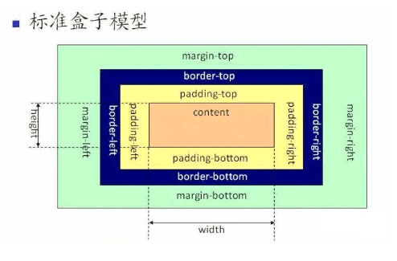
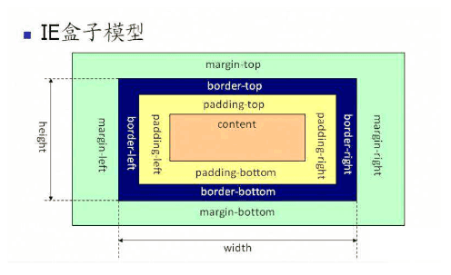
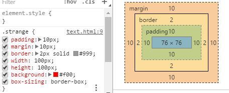
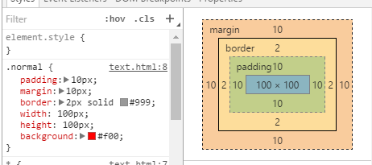

#怪异盒模型VS标准盒模型

>标准盒模型：W3C标准
>定义：一个块的总宽度=width+margin(左右)+padding(左右)+border(左右)  

>怪异盒模型：IE标准盒子模型
>定义：一个块的总宽度=width+margin（左右）（既width已经包含了padding和border值）  

## 使用怪异盒模型

>box-sizing:content-box || border-box || inherit;
>当设置为box-sizing:border-box时，将采用怪异模式解析计算；好处是便于整体计算，例如一个页面1000px，指定左右各500px，如果采用怪异模式，不需要care宽度和border，padding的影响，因为border,padding都归属于width。  
  
怪异盒子模型.png

  
标准盒子模型.png

