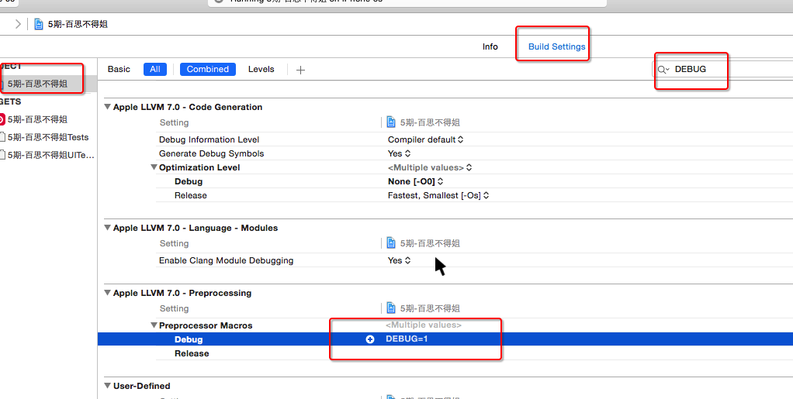

## PCH文件可能引发的错误

- 解决方案

```objc
#ifndef PrefixHeader_pch
#define PrefixHeader_pch

/*** 如果希望某些内容能拷贝到任何源代码文件(OC\C\C++等), 那么就不要写在#ifdef __OBJC__和#endif之间 ***/


/***** 在#ifdef __OBJC__和#endif之间的内容, 只会拷贝到OC源代码文件中, 不会拷贝到其他语言的源代码文件中 *****/
#ifdef __OBJC__


#endif
/***** 在#ifdef __OBJC__和#endif之间的内容, 只会拷贝到OC源代码文件中, 不会拷贝到其他语言的源代码文件中 *****/


#endif
```

## 在Build Setting中配置宏
- 如果项目中有些宏找不到, 可能是配置在Build Setting中


- 注意点:宏的名字不能全部是小写字母

- 如果宏的名字全部是小写, 会出现以下错误

