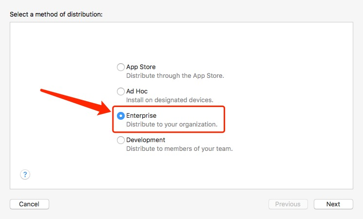

## ios证书配置
> 因是接手打包项目，所以证书已申请，直接配置即可
* 1.双击已生成的证书安装(两个都需要安装)
* 2.添加账号，下载Manual profiles
* 3.配置对应的bundle identifier,signing

## 打包流程
* 1.选择编译设备(通用设备)
* 2.archive模式开始打包
* 3.打包成功后打开项目列表（以便导出）
* 4.点击export进行导出
* 5.选择企业（因为项目是企业证书）
* 6.导出选项，优化等不用选择直接下一步
* 7.注意勾选对应的证书，然后导出到桌面即可